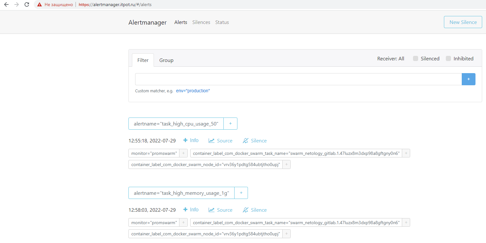

## Проект для развёртывания в инфраструктуре Yandex Cloud с помощью terraform кластера docker swarm с сервисами  wordpress, mysql (master+replica), gitlab, gitlab-runner, nginx, prometheus, grafana, alertmanager

Для развёртывания выполнить следующие действия (*предварительно требуется делегировать управление доменом ns серверам Yandex Cloud DNS, по умолчанию используется домен itpot.ru):  
1. В файле src/packer/centos-7-base.json указать folder_id и token  
2. Выполнить `cd src/packer/ && packer validate centos-7-base.json && packer build centos-7-base.json`  
3. В файле src/terraform/variables.tf заполнить все параметры  
4. В файле src/terraform/provider.tf указать access_key и secret_key для backend "s3"  
5. terraform init  
6. terraform plan  
7. terraform apply --auto-approve  

